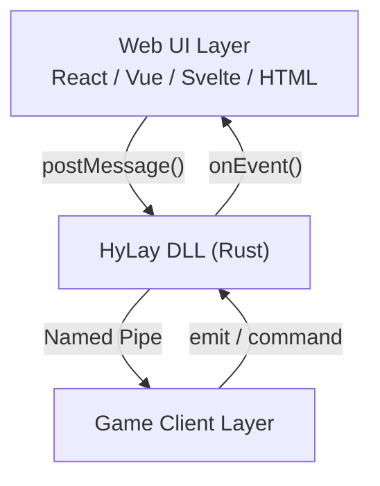
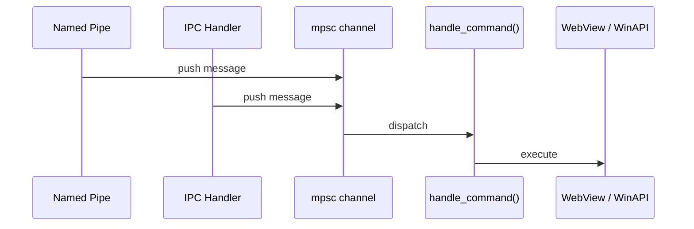

## Architecture overview

HyLay has three layers. Each layer communicates with the one next to it through a well-defined protocol.


---

## The message protocol

All communication uses the same JSON format, regardless of origin (web UI or game client):

```json
{
  "type": "emit_event",
  "event": "playerConnect",
  "payload": { "playerName": "Ruan625Br" },
  "origin": "client"
}
```

The `type` field tells the DLL what to do with the message. See the [Commands reference](/api-reference/commands) for all available types.

---

## Web UI → DLL

The WebView2 runtime exposes `window.ipc.postMessage()` to any page loaded inside it. HyLay registers an IPC handler in Rust that receives every message sent through it.

```ts
// In your web UI
window.ipc.postMessage(JSON.stringify({
  type: "set_click_through",
  enabled: false
}))
```

The DLL receives this on the main thread via `with_ipc_handler` and routes it to `handle_command`.

---

## Game client → DLL

The game client connects to the Named Pipe and writes newline-delimited JSON:

```json
{
  "type":"emit_event",
  "event":"playerConnect",
  "payload": { "playerName": "Ruan625Br" }
}\n
```

The DLL reads this in a background thread, parses the JSON, and sends it to the main thread via an `mpsc` channel.

<Info>
    The `\n` newline at the end of each message is required. The DLL uses it as a message delimiter to handle partial reads correctly.
</Info>

---

## DLL → Web UI

The DLL pushes events to the web UI by calling `evaluate_script`, which injects JavaScript directly into the WebView2 page:

```rust
// Inside the DLL
webview.evaluate_script(
  r#"window.__hyBridge?.onEvent({"event":"playerConnect","payload":{"playerName":"Ruan"},"origin":"client"})"#
)
```

Your web UI receives this through the `__hyBridge.onEvent` hook, which the `useHyEvent` hook subscribes to.

---

## Event bus

Both the Named Pipe thread and the IPC handler push messages into the same `mpsc` channel. The main loop drains this channel on every tick:



This means the same command (`set_click_through`, `emit_event`, etc.) works identically whether it comes from the web UI or the game client.

---
